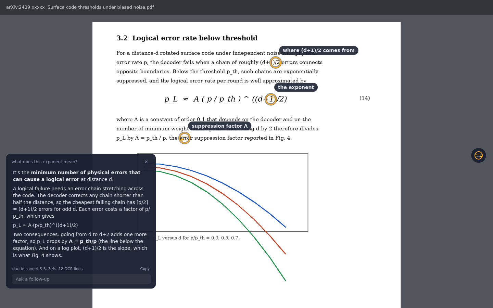

# Marginalia (prototype)

A study companion that floats over your screen. Press a shortcut (or click the orb), ask about
whatever you're reading or watching, and it answers in a small bubble while amber markers fly to
the parts of the screen it's talking about.




## Run it

```bash
python -m venv .venv
source .venv/bin/activate            # Windows: .venv\Scripts\activate
pip install -e .                     # the core app
pip install -e ".[ocr,voice]"        # optional: sharper pointing, ask by voice
cp .env.example .env                 # then paste your Anthropic API key into .env

marginalia --demo                    # try the interface with canned answers, no key needed
marginalia                           # the real thing (also: python -m marginalia)
```

## Use it

- **Ctrl+Alt+Space** asks about exactly where your mouse is. Type the question, press Enter.
- **The orb** (right edge of the screen) asks about wherever your mouse last rested. Click it and
  pick **Type** or **Speak**. Speaking ends on a short pause (or Enter/click); Esc cancels.
  Drag the orb anywhere; right-click it to quit.
- **Follow-ups** in the bubble re-capture the screen first, so they work while a lecture plays.
- **Esc or the close button** ends the thread and clears the markers.
- Every question, answer and screenshot is saved to `~/Marginalia/doubts/<date>.md`.

## Platform notes

| | |
|---|---|
| **macOS** | Grant *Screen Recording*, *Accessibility* and (for voice) *Microphone* to your terminal (or Python) in System Settings > Privacy & Security, then restart the terminal. A blank screenshot means Screen Recording is missing. If the hotkey crashes or does nothing, run with `--no-hotkey` and use the orb. |
| **Windows** | Works as is. If your antivirus flags the keyboard hook, use `--no-hotkey`. |
| **Linux** | Use an **X11** session for now. Wayland blocks global hotkeys, screen grabs and free window placement; it needs portal-based capture, planned for later. |

## How it works

```
shortcut / orb
   -> hide own windows, grab the screen under the cursor (Qt)
   -> OCR starts in the background while you type
   -> two images: full screen + close-up around the cursor (red ring marks the cursor)
      resized exactly the way the API resizes, so returned coordinates line up 1:1
   -> model replies with JSON: answer + up to 4 points (pixel coords, optional OCR line id)
   -> points snap onto OCR lines when the two agree, then map back to screen coordinates
   -> overlay animates markers; bubble picks a spot that covers neither cursor nor targets
```

| File | Job |
|---|---|
| `src/marginalia/capture.py` | Screen grab, HiDPI mapping, image resizing, cursor ring |
| `src/marginalia/ocr.py` | Optional RapidOCR text lines with boxes |
| `src/marginalia/brain/` | Prompt, API call, reply parsing, demo mode |
| `src/marginalia/pointing.py` | Point resolution and snapping, bubble placement |
| `src/marginalia/ui/` | Orb, type/speak chooser, ask and listen boxes, answer bubble, pointer overlay |
| `src/marginalia/voice.py` | Optional mic recording and local Whisper transcription |
| `src/marginalia/cursor.py` | Where the mouse last rested (what the orb asks about) |
| `src/marginalia/app.py` | Wiring, injectable services, threads, hotkey, follow-ups, journal |
| `eval/run_eval.py` | Accuracy harness: pointing hit rate and answer checks |

## Measure accuracy

```bash
python eval/run_eval.py            # runs every case in eval/cases
python eval/run_eval.py --no-ocr   # compare with OCR off
```

Whenever an answer or pointer is wrong in real use, copy its screenshot from
`~/Marginalia/doubts/shots/` into a new folder under `eval/cases/` and write a `case.json`
(see the docstring in `eval/run_eval.py`). Aim for 30+ real cases before changing prompts or models.

## Develop

```bash
pip install -e ".[ocr,voice,dev]"
pytest                               # ~150 tests, offscreen, no network or mic needed
pytest --cov=marginalia              # with coverage
ruff check .                         # lint
```

- **Architecture:** [`docs/architecture.md`](docs/architecture.md) explains the layers, the three
  coordinate spaces and the threading rules. Each design choice has a short record in
  [`docs/adr/`](docs/adr/) with the alternatives that were turned down.
- **Workflow:** branch from `main`, keep commits small, open a PR; CI runs lint and tests on
  Linux and macOS. A change to a dependency, data flow or module boundary gets a new ADR.
- **Tests:** logic goes in plain modules and gets plain tests; widgets get pytest-qt tests; slow
  or external things are injected through `app.Services` and replaced by the fakes in
  `tests/helpers.py`. A bug fix starts with a failing test that names the bug.
- **Plan:** [`ROADMAP.md`](ROADMAP.md).
