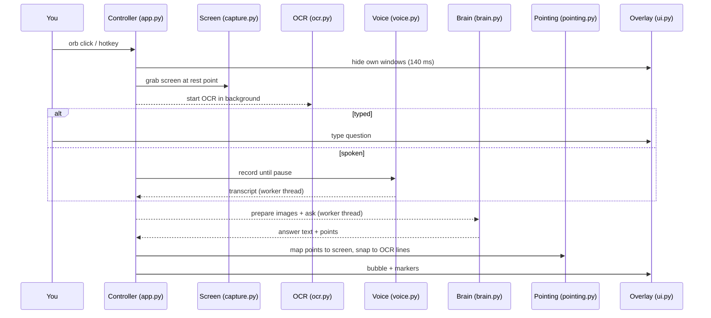

# Architecture

Marginalia is a desktop overlay. You ask about something on screen; it grabs the screen, asks
Claude, shows the answer in a bubble and flies markers to what the answer talks about.

## One question, end to end



## Folders

```
src/marginalia/      the app (installed with pip install -e .; see ADR 0010)
  brain/             prompt, parsing, the API call, demo mode
  ui/                theme and painting, shared widgets, one module per window
  *.py               capture, ocr, pointing, cursor, voice, doubtlog, config, app (wiring)
tests/               unit and pytest-qt tests; fakes in helpers.py
eval/                answer-quality harness and labelled cases (costs real API calls)
docs/                this file, ADRs, README images
```

## Layers

The rule: **logic lives in plain Python modules; Qt widgets only draw and emit signals.**
That is what lets 150 tests run in seconds with no display, no microphone and no network.

| Layer | Modules | Knows about Qt? | Tested by |
|---|---|---|---|
| Pure core | `capture` (math), `brain.prompt`, `brain.parsing`, `pointing`, `cursor`, `voice.SilenceDetector`, `config`, `doubtlog` | No | plain unit tests |
| Adapters | `capture.grab_screen`, `ocr.OCR`, `voice.Recorder`/`Transcriber`, `brain.claude.ClaudeBrain` | Only `grab_screen` | fakes injected through factories |
| UI | `ui/` (one module per window) | Yes | pytest-qt, offscreen |
| Wiring | `app.Controller`, `app.Services` | Yes | pytest-qt with every service faked |

## Three coordinate spaces

The hardest correctness problem in the app. See [ADR 0003](adr/0003-resize-images-ourselves.md).

| Space | Unit | Who uses it |
|---|---|---|
| logical | Qt desktop points | the overlay, the cursor |
| physical | screenshot pixels (logical x device pixel ratio) | OCR boxes, cropping |
| sent | pixels of the resized image Claude sees | the model's answers |

## Threads

The Qt main thread owns every widget. Slow work (OCR, the API call, transcription, loading the
speech model) runs on a `ThreadPoolExecutor`; results come back through `Bus` signals, which Qt
delivers on the main thread. Every request carries an id, so a late answer to an abandoned
question is dropped. See [ADR 0007](adr/0007-concurrency-model.md).

## Decisions

Each non-obvious choice has a short record in [`docs/adr/`](adr/), with the alternatives that
were turned down and why.
